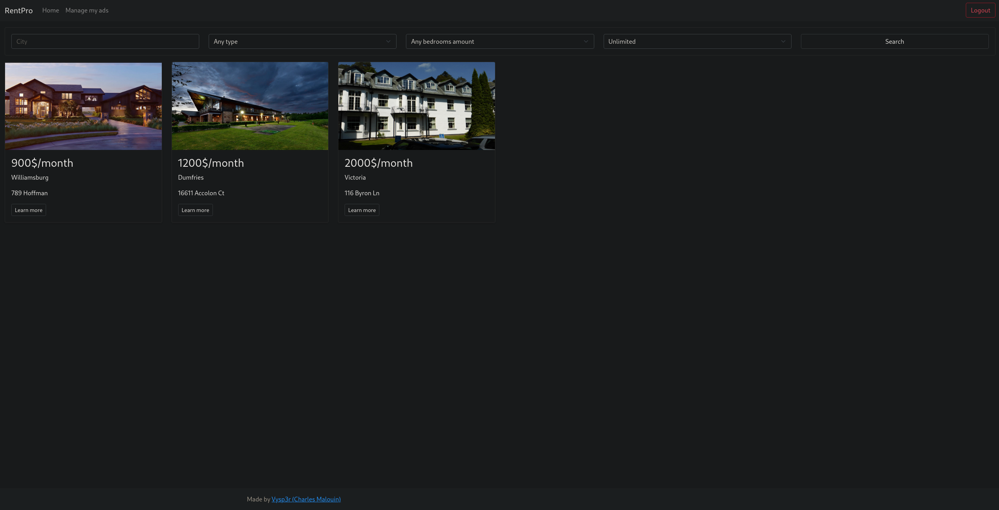

# php-rentpro
- - - -
### Description

A simple php website to find places that are for rent and create ads if you have places you want to rent.

I know the house picture looked stretched in the second picture, but I can't do anything better as of right now with my skill in CSS. I will try to update this project once in a while when I have time to fix these issue.

### Features

- View ads
- Create ads that can contain up to one image
- Create an account
- Login to your account
- Leave a review
- View the reviews
- Advanced search tool

### How to use

- Install XAMPP (or any alternative)
- Import the SQL database to your server
- Change database connection information in /core/dbConfig.php
- Enjoy!

If you have any problems using this or have any recommendations to improve this project, feel free to share that with me.
